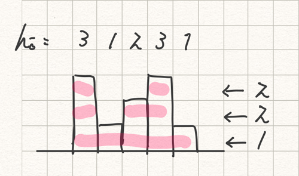

<!--
.. title: ABC116_C
.. slug: abc116_c
.. date: 2019-04-10 00:57:39 UTC+09:00
.. tags: ABC
.. category: ABC
.. link: 
.. description: AtCoder abc116_c solution
.. type: text
.. has_math: true
-->

[C - Grand Garden](https://atcoder.jp/contests/abc116/tasks/abc116_c)

各 \\(h_i\\) に必要な水やり回数を縦に積む.
それを下から順に「連続した区間が何個できるか」を数えていき, 最後にそれらを合計する.

####  入力例2 の場合の考え方



#### code

```py
N = int(input())
H = list(map(int, input().split()))

cnt = 0
for i in range(1, 101):
    flg = False
    for j in range(N):
        if H[j] < i and flg:
            cnt += 1
        flg = H[j] >= i
    if flg:
        cnt += 1
print(cnt)
```
